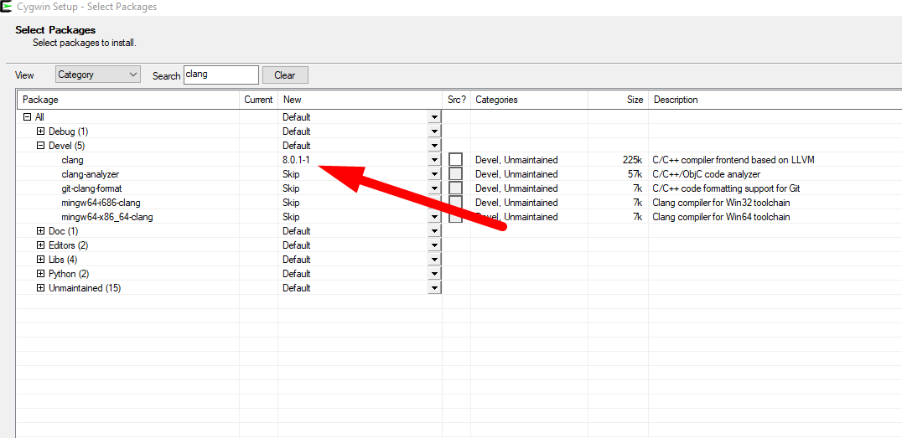
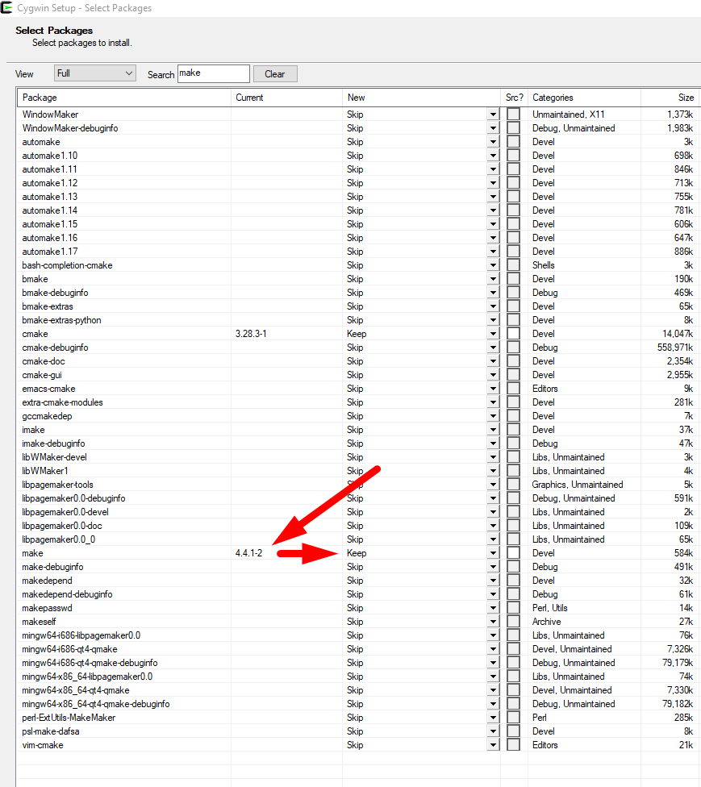
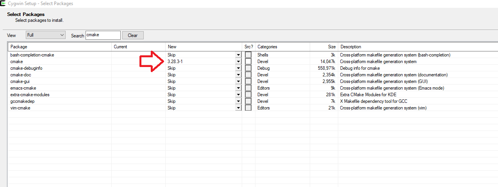
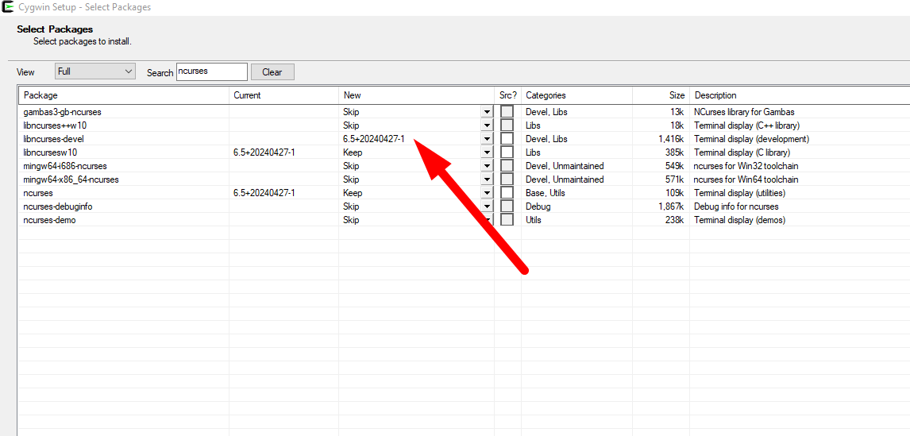

# Pacman

Программа написана на чистом C в качестве лабораторной. 

Программа использует ncurses (работа с окнами/меню к терминале).

На момент написания я не нашел в открытом доступе полностью готовых решений, поэтому выкладываю своё.

## Содержание

1. Ubuntu 
   
   1.1. Установка зависимостей
   
   1.2. Сборка

2. Windows 10
   
   2.1. Установка зависимостей
   
   2.2. Сборка

## 1. Ubuntu

Программа изначально была написана в Ubuntu.

### 1.1. Установка зависимостей

Для сборки используется cmake.

Компилятор clang.

Библиотека ncurses.

`sudo apt-get install clang make cmake libncurses-devel`

### 1.2. Сборка

1. Создайте директорию debug
   
   `mkdir debug`

2. Перейдите в директорию debug
   
   `cd debug`

3. Сконфигурируйте проект
   
   `cmake -DCMAKE_BUILD_TYPE=Debug ..`

4. Запустите сборку
   
   `make`

5. Запустите игру (**Важно!** Окно терминала должно быть не менее 30 строк, чтобы увидеть полный интерфейс)
   
   `./pacman_game_debug

## 2. Windows 10

### 2.1. Установка зависимостей

Для сборки проекта вам потребуется cygwin (mingw не подойдет).

1. Скачайте cygwin с сайта [Cygwin Installation](https://www.cygwin.com/install.html) (**Важно!** При установке нужно будет выбрать дополнительные пакеты, о них читайте ниже)

2. Пакет clang
   
   

3. Пакет make
   
   

4. Пакет cmake
   
   

5. Пакет libncurses-devel
   
   

### 2.2. Сборка

1. Откройте Cygwin консоль

2. Создайте директорию debug
   
   `mkdir debug`

3. Перейдите в директорию debug
   
   `cd debug`

4. Сконфигурируйте проект
   
   `cmake -DCMAKE_BUILD_TYPE=Debug ..`

5. Запустите сборку
   
   `make`

6. Запустите игру (**Важно!** Окно терминала должно быть не менее 30 строк, чтобы увидеть полный интерфейс)
   
   `./pacman_game_debug
